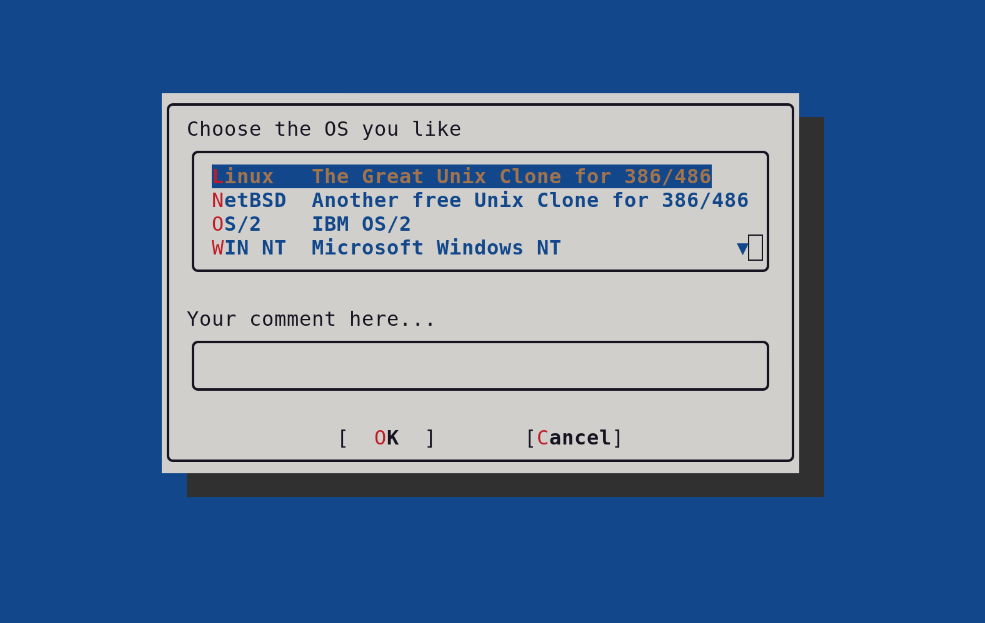

# SourceDialog

SourceDialog is a pure Bash TUI dialog library you can source from your own
scripts to create interactive terminal forms — no external dependencies
(dialog, whiptail, ncurses, etc.).



## Features

- **Pure Bash** — single file, no dependencies, just `source` it
- **All standard widgets** — canvas, frame, textbox, pushbutton, inputbox,
  passwordbox, menubox, checklist, radiolist
- **Unicode rendering** — rounded box-drawing characters, modern markers,
  scroll indicators (auto-detected, falls back to legacy ACS)
- **256-color support** — auto-detected, smoother shadows and custom themes
- **Customizable** — override any `_SD_*` color/style variable before calling
  `sd_start`
- **Full API compatibility** — drop-in upgrade for the original SourceDialog
- **Bash 4.3+**

## Quick Start

```bash
source /path/to/sourcedialog

myvar=""

sd_load_canvas     name=cv1 x=10 y=2 width=40 height=8 caption=" MY FORM "
sd_load_textbox    name=tb1 x=13 y=4 width=34 text="Enter your name:"
sd_load_inputbox   name=ib1 x=13 y=6 width=34 varname=myvar
sd_load_pushbutton name=ok  x=20 y=8 caption="  OK  "
sd_load_pushbutton name=cc  x=30 y=8 caption=" Cancel "

sd_ok_push()  { return 0; }
sd_cc_push()  { return 1; }

sd_start
```

## API

### Widget Registration

| Function | Description |
|---|---|
| `sd_load_canvas` | Frame/decoration |
| `sd_load_frame` | Concave frame (no shadow) |
| `sd_load_textbox` | Static text |
| `sd_load_pushbutton` | Button |
| `sd_load_inputbox` | Text input |
| `sd_load_passwordbox` | Password input |
| `sd_load_menubox` | Selection list |
| `sd_load_checklist` | Multi-select list |
| `sd_load_radiolist` | Single-select list |

### Lifecycle

| Function | Description |
|---|---|
| `sd_start` | Init, draw, read, reset (main entry point) |
| `sd_init` | Set up terminal (hide cursor, raw mode) |
| `sd_draw` | Render all registered widgets |
| `sd_read` | Interactive input loop |
| `sd_reset` | Restore terminal |
| `sd_clear` | Unregister all widgets (for multi-page dialogs) |

### Return Codes

| Code | Meaning |
|---|---|
| `0` | OK / confirm |
| `1` | Cancel |
| `27` | Escape |
| `127` | Not interactive |
| `254` | Move backward |
| `255` | Move forward |

### Customizable Variables

Set any of these before `sd_start` to customize appearance:

**Colors** (values: 0–7 for 8-color, 0–255 for 256-color terminals):

`_SD_BG`, `_SD_FG`, `_SD_FRAME_BG`, `_SD_FRAME_HI`, `_SD_FRAME_LO`,
`_SD_TEXT_FG`, `_SD_TEXT_BG`, `_SD_BTN_FG`, `_SD_BTN_BG`, `_SD_BTN_KEY`,
`_SD_BTN_SEL_FG`, `_SD_BTN_SEL_BG`, `_SD_INPUT_FG`, `_SD_INPUT_BG`,
`_SD_INPUT_SEL_FG`, `_SD_INPUT_SEL_BG`, `_SD_LIST_FG`, `_SD_LIST_BG`,
`_SD_LIST_KEY`, `_SD_LIST_SEL_FG`, `_SD_LIST_SEL_BG`, `_SD_SHADOW_BG`

**Style:**

| Variable | Default | Values |
|---|---|---|
| `_SD_STYLE` | `auto` | `auto`, `unicode`, `legacy` |
| `_SD_CORNER` | `rounded` | `rounded`, `square` (unicode only) |
| `_SD_256COLOR` | `auto` | `auto`, `yes`, `no` |

### Keybindings

| Key | Action |
|---|---|
| Arrow keys | Navigate items (list) |
| Space | Toggle selection (list) |
| Tab / Enter | Move forward |
| Shift+Tab | Move backward |
| Home / End | First / last item |
| Page Up / Down | Scroll page |
| Escape | Cancel |
| Backspace | Delete character (input) |
| Any letter | Jump to matching item (list) |

## Examples

```bash
bash examples/demo        # multi-page dialog with all widgets
bash examples/example1    # OS chooser
bash examples/example2    # address form
bash examples/example3    # account creation
```

## License

Copyright (c) 2025 Robin Dubreuil <robindubreuil@users.noreply.github.com>
Licensed under the GNU General Public License v3. See [LICENSE](LICENSE).

## Credits

Inspired by **SourceDialog** by Antonio Macchi (2008), originally posted to
`comp.os.linux.development.apps` on 2008-11-07. This is a complete rewrite
aiming to be a drop-in upgrade with full API compatibility.
